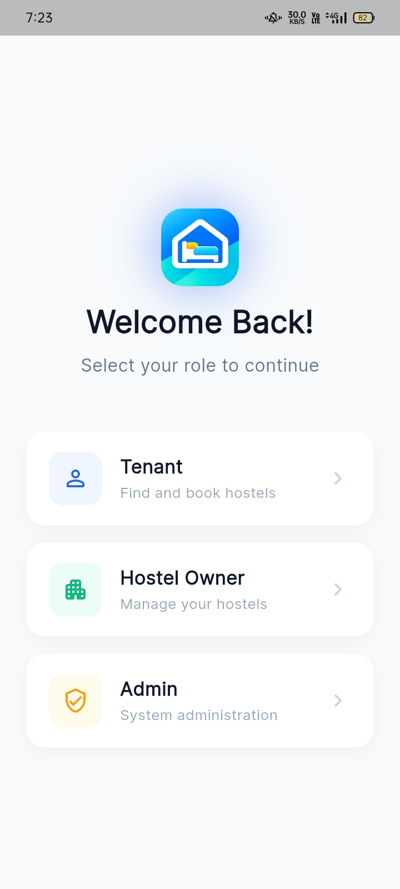
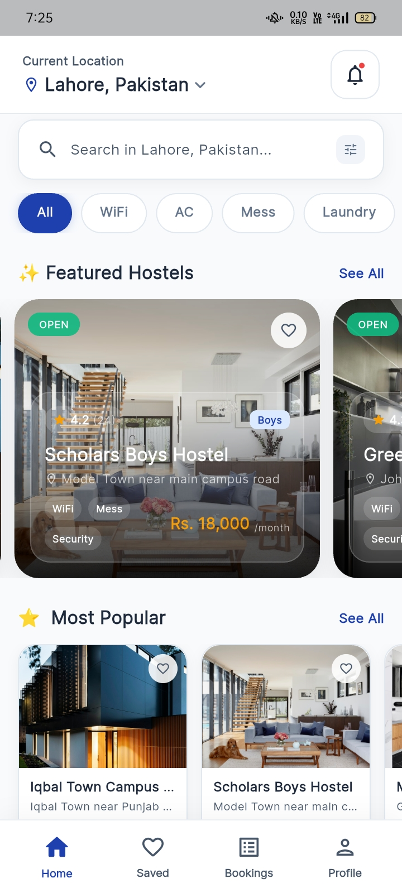
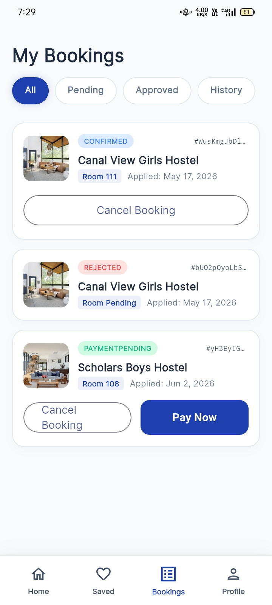
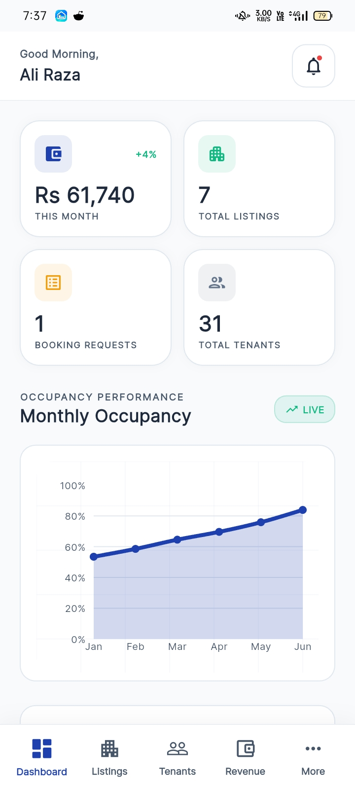
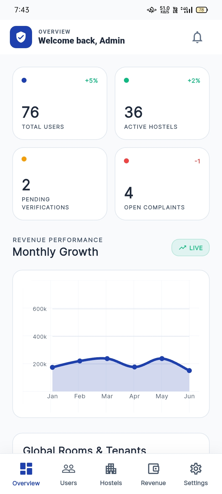

# 🏢 HostelX — Pakistan's Student Hostel Finder 🇵🇰

[](https://flutter.dev)
[](https://firebase.google.com/)
[](https://stripe.com)
[](https://vercel.com)

**HostelX** is a modern, feature-rich Flutter application designed to revolutionize how students and young professionals in Pakistan find, book, and manage their hostel stays. Built with scalability and security in mind, it bridges the gap between hostel owners and tenants.

---

## ✨ Key Features

### 🔍 For Tenants
- **Smart Search & Filter**: Find the perfect home by city, area, budget, and specific facilities (WiFi, AC, Mess, etc.).
- **Seamless Booking**: A streamlined flow for room selection and booking.
- **Secure Payments**: Integrated with **Stripe** for easy rent and security deposit payments.
- **Instant Notifications**: Real-time push alerts for booking status and system updates.

### 🏠 For Hostel Owners
- **Powerful Dashboard**: Manage listings, track bookings, and view detailed financial analytics.
- **Payout Tracking**: Transparent management of earnings and Stripe payouts.
- **Tenant Management**: Keep track of who is staying and their payment history.

### 🛡️ For Administrators
- **Platform Oversight**: Full control over users, hostel approvals, and resolving complaints.
- **Financial Controls**: Set commission rates and manage platform-wide settings.

---

## 📸 Screenshots

<div align="center">
  <table>
    <tr>
      <td align="center">
        <b>Role Selection</b><br/>
        
      </td>
      <td align="center">
        <b>Tenant Dashboard</b><br/>
        
      </td>
      <td align="center">
        <b>Hostel Details</b><br/>
        
      </td>
    </tr>
    <tr>
      <td align="center">
        <b>Booking Screen</b><br/>
        
      </td>
      <td align="center">
        <b>Owner Dashboard</b><br/>
        
      </td>
      <td align="center">
        <b>Admin Dashboard</b><br/>
        
      </td>
    </tr>
  </table>
</div>

---

## 🧰 Tech Stack

| Layer | Technology |
|---|---|
| **Framework** | Flutter (Dart) |
| **Architecture** | MVVM |
| **State Management** | Provider |
| **Backend & Database** | Firebase Firestore |
| **Authentication** | Firebase Auth |
| **File Storage** | Firebase Storage |
| **Push Notifications** | Firebase Cloud Messaging + Node.js (Vercel) |
| **Payments** | Stripe |
| **Platform** | Android & iOS (Cross-Platform) |

---

## 🏗️ Project Architecture

```bash
.
├── lib/                  # 🚀 Flutter Source Code
│   ├── core/             # 🛠️ App Config, Themes & Utils
│   ├── data/             # 📂 Models & Services (Firebase/Stripe)
│   ├── domain/           # 🧠 Business Logic & Entities
│   ├── features/         # 🎨 UI Screens (Tenant, Owner, Admin)
│   ├── providers/        # 🏗️ State Management
│   └── routes/           # 🛣️ Navigation
├── push-server/          # ⚡ Node.js Vercel Functions (Notifications)
├── scripts/              # 🧪 Firebase Seeding & Maintenance
├── assets/               # 🖼️ Images & Fonts
└── android/ios/          # 📱 Platform Specifics
```

---

## 🛠️ Setup Instructions

### 1️⃣ Prerequisites
- Flutter SDK `>=3.x.x`
- Node.js `>=18.x`
- A Firebase project
- A Stripe account

### 2️⃣ Environment Configuration 🔑
We use environment variables to keep your sensitive keys secure. **Never share your `.env` file!**

```bash
# 📂 In the Root Directory:
cp .env.example .env

# 📂 In the Push Server Directory:
cd push-server
cp .env.example .env.local
```

> [!IMPORTANT]
> Open the new `.env` files and fill in your **Stripe API Keys** and **Firebase Service Account** details.

### 3️⃣ Firebase Integration 🔥
1. Create a project in the [Firebase Console](https://console.firebase.google.com/).
2. Download `google-services.json` (Android) to `android/app/`.
3. Download `GoogleService-Info.plist` (iOS) to `ios/Runner/`.
4. Generate a **Service Account Key** (JSON) from *Project Settings > Service Accounts* and save it as `serviceAccountKey.json` in the project root.

### 4️⃣ Stripe Integration 💳
1. Get your **Publishable** and **Secret** keys from the [Stripe Dashboard](https://dashboard.stripe.com/test/apikeys).
2. Add them to your `.env` file under `STRIPE_PUBLISHABLE_KEY` and `STRIPE_SECRET_KEY`.

---

## 🚀 Running the Application

### Launch Flutter App
Use the `--dart-define-from-file` flag to securely load your environment variables:

```bash
flutter run --dart-define-from-file=.env
```

### Seed Demo Data
Populate your Firestore with high-quality demo data:

```bash
cd scripts
npm install
node seed_firebase.js
```

---

## 🔒 Security & Best Practices
- ✅ **`.env` files** are ignored by Git.
- ✅ **Config files** (`google-services.json`, etc.) are ignored by Git.
- ✅ **API Keys** are injected at build time via environment variables.

---

## 👨‍💻 Author

<div align="center">
  <b>Muhammad Altaf</b><br/>
  Flutter Developer &nbsp;|&nbsp; BS Information Technology<br/><br/>
  <a href="https://www.linkedin.com/in/muhammad-altaf1">
    
  </a>
  &nbsp;
  <a href="https://www.instagram.com/altaf.code">
    
  </a>
  &nbsp;
  <a href="https://github.com/altafcode">
    
  </a>
</div>

---

<div align="center">
  Developed with ❤️ for the students of Pakistan.
</div>
